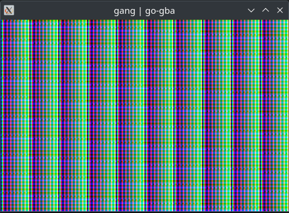
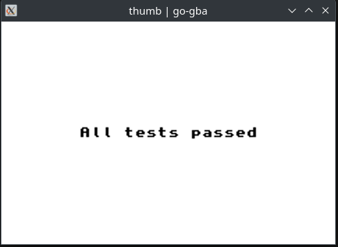

# go-gba

This is a toy emulator project mostly embarked on in order to better understand ARM CPUs.

Right now, it's barely functional but does decode a small portion of ARM and THUMB instructions.

PPU modes 3 and 4 are implemented.

## Screenshots

Still super early. Don't expect _any_ retail games to run.

### `panda.gba`

### `gang.gba`

### `thumb.gba`

